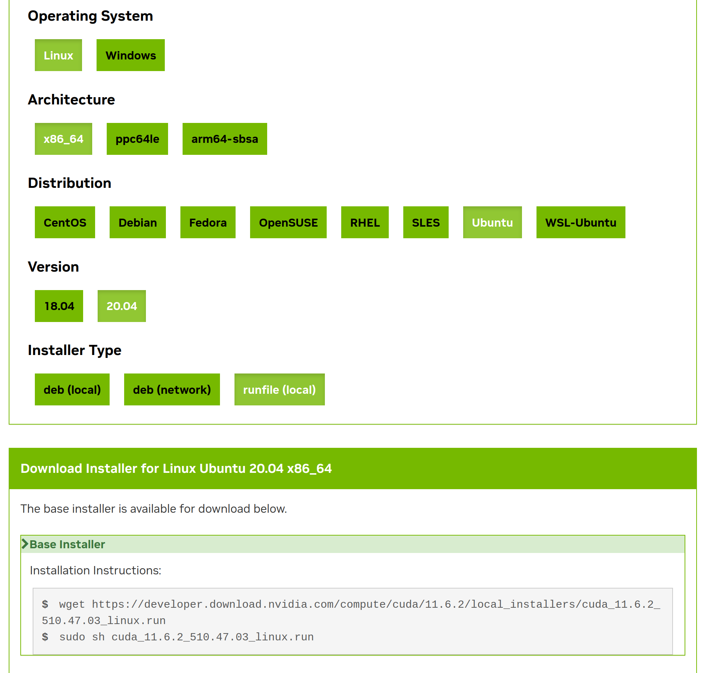

# Terrestrial-Aerial-Navigation on Ubuntu20.04

## 一、 下载ROS及其附属

```
wget http://fishros.com/install -O fishros && . fishros 
#鱼香ROS一键安装
```

## 二、 下载源码
+ `git clone https://github.com/ZJU-FAST-Lab/Terrestrial-Aerial-Navigation.git `

## 三、 安装依赖

1. 安装显卡驱动
 

+ 查看是否安装NVIDIA显卡与驱动，若未出现状态面板，则未安装驱动
```
lspci | grep -i nvidia
nvidia-smi
```
+ 安装驱动
```
sudo add-apt-repository ppa:graphics-drivers/ppa
sudo apt update
#添加源并更新软件包列表
```
```
ubuntu-drivers devices
#检查可安装的驱动,在弹出的列表中选择一个合适的驱动进行安装
sudo apt install nvidia-driver-XXX
#安装后重启，就可以通过nvidia-smi看到显卡信息
```
重启后可能会导致无法进入桌面
+ 在开机启动页面进入Ubuntu(recovery mode)
+ 在Recovery Menu里选择root
+ 卸载Nvidia显卡驱动
```
sudo apt-get purge nvidia*
sudo apt-get autoremove
#卸载Nvidia驱动

sudo apt-get install --reinstall ubuntu-desktop
#重装ubuntu-desktop

sudo reboot
#重启
```
重复上面安装Nvidia驱动的步骤，选择不同的驱动版本再次尝试

2. 安装CUDA
+ 降低g++版本
```
sudo apt-get install gcc-7 g++-7
 
sudo update-alternatives --install /usr/bin/gcc gcc /usr/bin/gcc-7 9
sudo update-alternatives --install /usr/bin/gcc gcc /usr/bin/gcc-9 1
 
sudo update-alternatives --display gcc
 
sudo update-alternatives --install /usr/bin/g++ g++ /usr/bin/g++-7 9
sudo update-alternatives --install /usr/bin/g++ g++ /usr/bin/g++-9 1
 
sudo update-alternatives --display g++
```
+ 去官网下载CUDA(https://developer.nvidia.com/cuda-toolkit-archive)

在wiki上查找自己显卡对应CUDA版本(https://en.wikipedia.org/wiki/CUDA#Version_features_and_specifications)

如图

+ 按照下图选择并运行网页提供的代码

在安装项处取消勾选显卡驱动，如下图

+ 配置环境变量
```
export PATH=/usr/local/cuda-XX.X/bin${PATH:+:${PATH}}
# XX.X为安装的CUDA版本

export LD_LIBRARY_PATH=/usr/local/cuda-XX.X/lib64\${LD_LIBRARY_PATH:+:${LD_LIBRARY_PATH}}
# XX.X为安装的CUDA版本

source ~/.bashrc
```
+ 将这个文件中

/Terrestrial-Aerial-Navigation/src/uav_simulator/local_sensing/CMakeLists.txt

把
中的两个80改为自己GPU所对应的数字，可以在这里找到(https://arnon.dk/matching-sm-architectures-arch-and-gencode-for-various-nvidia-cards/)

3. 安装OpenCV
+ 安装所有依赖软件包
```
    sudo apt install build-essential cmake git pkg-config libgtk-3-dev \
    libavcodec-dev libavformat-dev libswscale-dev libv4l-dev \
    libxvidcore-dev libx264-dev libjpeg-dev libpng-dev libtiff-dev \
    gfortran openexr libatlas-base-dev python3-dev python3-numpy \
    libtbb2 libtbb-dev libdc1394-22-dev libopenexr-dev \
    libgstreamer-plugins-base1.0-dev libgstreamer1.0-dev

```
+ 下载OpenCV和OpenCV contrib源码
```
mkdir ~/opencv_build && cd ~/opencv_build

git clone https://github.com/opencv/opencv.git

git clone https://github.com/opencv/opencv_contrib.git

```

+ 配置构建OpenCV
```
cd ~/opencv_build/opencv
mkdir -p build && cd build

cmake -D CMAKE_BUILD_TYPE=RELEASE \
    -D CMAKE_INSTALL_PREFIX=/usr/local \
    -D INSTALL_C_EXAMPLES=ON \
    -D INSTALL_PYTHON_EXAMPLES=ON \
    -D OPENCV_GENERATE_PKGCONFIG=ON \
    -D OPENCV_EXTRA_MODULES_PATH=~/opencv_build/opencv_contrib/modules \
    -D BUILD_EXAMPLES=ON ..

    # OPENCV_EXTRA_MODULES_PATH后面为自己的opencv_contrib路径

```
+ 编译(16改为自己处理器的核心数量)

`make -j16`

+ 安装

`sudo make install`

+ 查看版本

`pkg-config --modversion opencv4`

4. 安装NLopt
+ 前往官网下载压缩包(https://nlopt.readthedocs.io/en/latest/)
解压后在文件夹内执行

`cmake . && make && sudo make install`

5. 安装其他库(可能已安装)

`sudo apt-get update`

+ Eigen3

`sudo apt-get install libeigen3-dev
`
+ boost

`
sudo apt-get install libboost-all-dev
`

+ armadillo

``sudo apt-get install libarmadillo-dev ros-noetic-nlopt``

## 四、根据ubuntu20.04修改相关内容
1. 修改/Terrestrial-Aerial-Navigation/src/uav_simulator/Utils/poly_traj_server/CMakeLists.txt
添加以下内容
2. 修改Terrestrial-Aerial-Navigation/src/TIE_navigation/bspline_opt/CMakeLists.txt文件，将所有和NLopt相关的代码修改为
```
find_package(NLopt REQUIRED)
set(NLopt_INCLUDE_DIRS ${NLOPT_INCLUDE_DIR})

...

include_directories( 
    SYSTEM 
    include 
    ${catkin_INCLUDE_DIRS}
    ${Eigen3_INCLUDE_DIRS} 
    ${PCL_INCLUDE_DIRS}
    ${NLOPT_INCLUDE_DIR}
)

...

add_library( bspline_opt 
    src/bspline_optimizer.cpp 
    )
target_link_libraries( bspline_opt
    ${catkin_LIBRARIES} 
    ${NLOPT_LIBRARIES}
    )  

```
3. 在所有包的CMakeLists.txt文件内添加

`set(CMAKE_CXX_STANDARD 14)`

## 编译并运行
```
cd Terrestrial-Aerial-Navigation
catkin_make
source devel/setup.bash
sh src/run.sh
```
+ 进入RViz以后使用2D Nav Goal给出目标点


